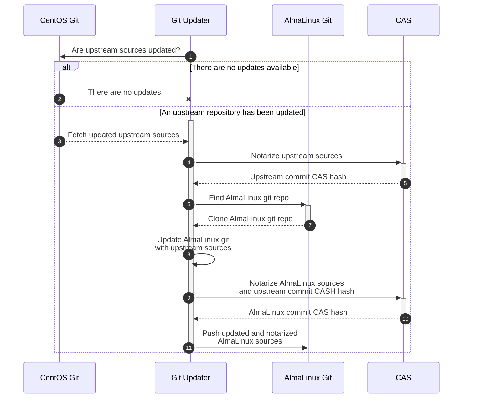

# [RFE] Implement SBOM in the AlmaLinux Build System


## Introduction

This document describes an [SBOM](https://en.wikipedia.org/wiki/Software_supply_chain)
implementation for the [AlmaLinux Build System](https://build.almalinux.org/)
based on the [Codenotary Community Attestation Service (CAS)](https://github.com/codenotary/cas).


## SBOM integration overview

### AlmaLinux OS git repositories notarization




### AlmaLinux OS Build System artifacts notarization


## Codenotary CAS usage


### Get Codenotary CAS API key

To get started with the Codenotary CAS service you need to obtain an AIP key:
follow the instructions on the [cas.codenotary.com](https://cas.codenotary.com/)
page.


### Notarizing an asset

Notarization calculates an SHA-256 hash of an asset (e.g. file, directory, git
repository commit, etc.), collects metadata (depends on an asset format)
and creates a new trusted record in the CAS database:

```
# notarizes a git repository
$ cas notarize git:///home/ezamriy/work/almalinux/codenotary/cloud-images/

UID:		1654528312837519361
Kind:		git
Name:		git@github.com:AlmaLinux/cloud-images.git@5b9c88b
Hash:		5f1c7f203d2b90fb369da5f6b4bac5745b21b912326ade0860f66050ddb71aa4
Size:		835 B
Timestamp:	2022-06-06 15:11:52.837519361 +0000 UTC
Metadata:	git={
		    "Author": {
		        "Email": "elkhan.mammadli@protonmail.com",
		        "Name": "Elkhan Mammadli",
		        "When": "2022-06-03T16:08:56+04:00"
		    },
		    "Commit": "5b9c88b35bc1edaa0f30e9e23a790044396b6b25",
		    "Committer": {
		        "Email": "noreply@github.com",
		        "Name": "GitHub",
		        "When": "2022-06-03T16:08:56+04:00"
		    },
		    "Message": "Merge pull request #97 from LKHN/ami-90\n\nAdd 9 AMIs and some fixes for Generic Cloud Images",
		    "PGPSignature": "-----BEGIN PGP SIGNATURE-----\n\nwsBcBAABCAAQBQJimfnYCRBK7hj4Ov3rIwAA5CoIAJzD+iXIQ0MKqn9ql+KNGPNi\nSxUenCrZQiFn8NZ14saJwJKQUWpXHfWR2ej2K6WdD+X+0mjpUnoxF3QPhckNhVjA\nyutS8mcttagO25CTsorkTwOGYE1LTdzoU/13Ow+jYMMr7Zl6bb0M2GxZwLkpOiVd\ndLUHzvwzYUvcMh4vx1sq/7Dl4bqbYCbA/N1zavtxXFg94+JqOl19H6BeW5ASI1r1\n8U+9nW3J+vXCDu2FMyzTm03R+ghUvT/0/tRlR0df4OXjxCWZeh4g50U+7Fs22cJj\nWjWcv9ELKDhdHpI7tYDMqo6rLuRFk8pTi71yN8h4izSQwkSb92/SYiEPkIz+s+k=\n=HWtS\n-----END PGP SIGNATURE-----\n\n",
		    "Parents": [
		        "71fb43d2e4d0fd3f3ce3cceb8da6534c18a43f4c",
		        "3afd0c736f78b929e40e1a32ab9271b1eeca978b"
		    ],
		    "Tree": "02c0afeb4182792c24310a178ac22ba9e1bc64f2"
		}
		git_uri="git@github.com:AlmaLinux/cloud-images.git"
SignerID:	ZXphbXJpeUBhbG1hbGludXgub3Jn
Apikey revoked:	no
Status:		TRUSTED
```

It is also possible to add additional attributes to the metadata for further
processing using the `--attr key=value` command line argument(s):

```
# notarizes a git repository and adds additional metadata information
$ cas notarize git:///home/ezamriy/work/almalinux/codenotary/cloud-images/ \
               --attr verified_by=ezamriy@almalinux.org

UID:		1654528972904666602
Kind:		git
Name:		git@github.com:AlmaLinux/cloud-images.git@5b9c88b
Hash:		5f1c7f203d2b90fb369da5f6b4bac5745b21b912326ade0860f66050ddb71aa4
...
Metadata:	git={
		    ...
		}
		verified_by="ezamriy@almalinux.org"
SignerID:	ZXphbXJpeUBhbG1hbGludXgub3Jn
Apikey revoked:	no
Status:		TRUSTED
```


## References

* [AlmaLinux Git Updater](https://github.com/AlmaLinux/git_migrator)


## Authors

* [Eugene Zamriy](mailto:ezamriy@almalinux.org)
* [Vasiliy Kleschov](mailto:vkleschov@almalinux.org)
