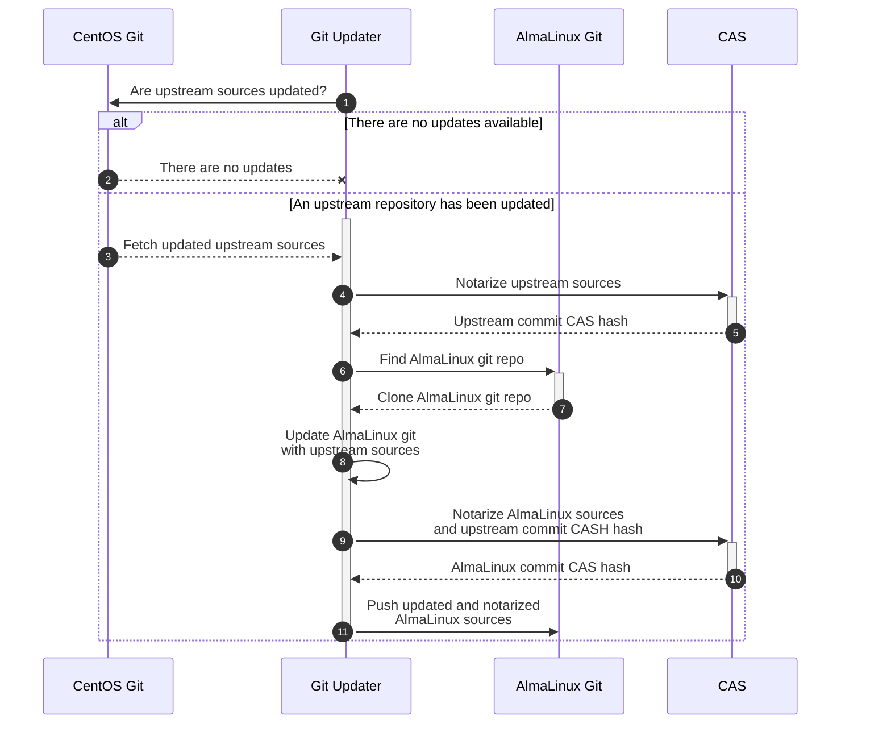
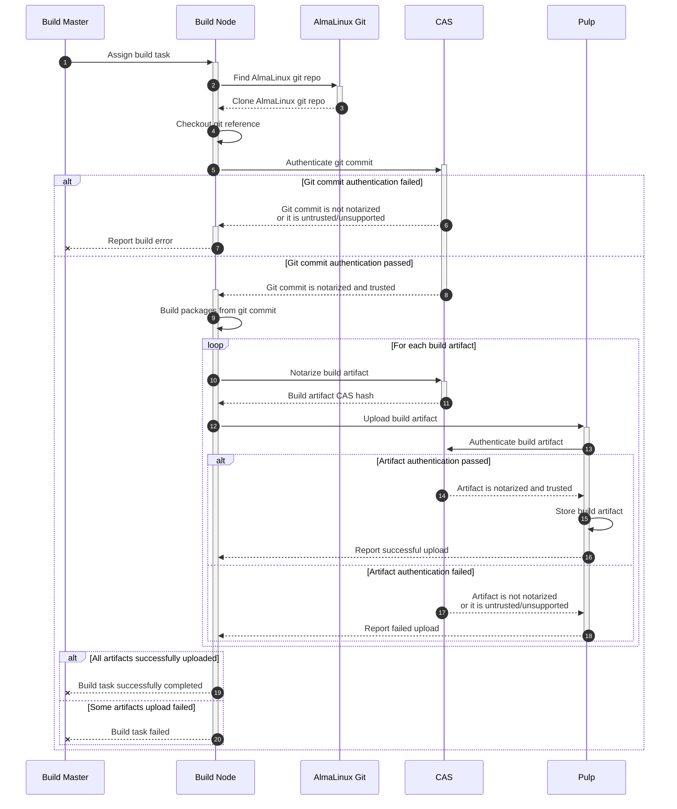
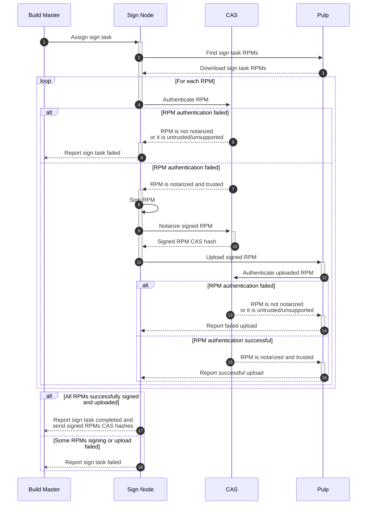
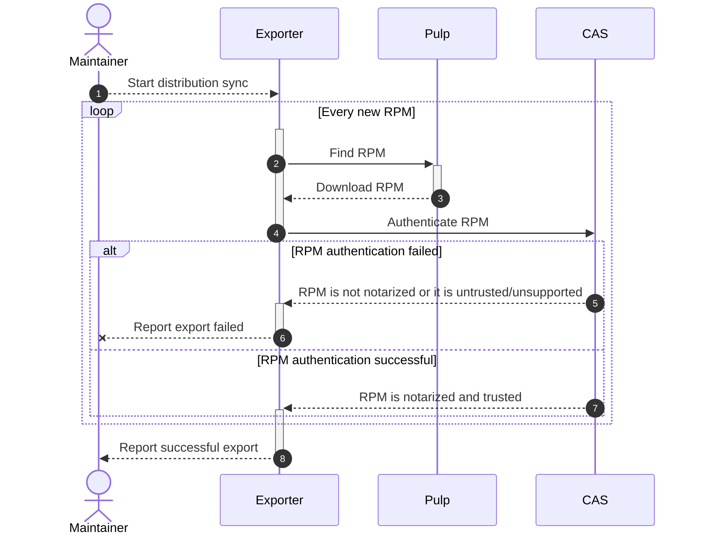

# [RFE] Implement SBOM in the AlmaLinux Build System


## Introduction

### Purpose of document

This document describes an [SBOM](https://en.wikipedia.org/wiki/Software_supply_chain)
implementation for the [AlmaLinux Build System](https://build.almalinux.org/)
based on the [Codenotary Community Attestation Service (CAS)](https://github.com/codenotary/cas).


### Purpose of SBOM integration

By integrating SBOM into our build pipeline we want to achieve the following
goals:

1. Secure our supply chain: ensure that the distribution updates were built
   from a trusted source, that an attacker didn't change/replace them after a
   build/testing stage and so on. Ideally, we would like to be able to trace a
   full path starting from CentOS git repositories and ending with delivering
   verified and signed packages to our public repositories.

2. Reduce the number of ways data can be corrupted (e.g. due to a software
   bug or a network error) in our system. Ensure that we always operate with
   valid and consistent data.

3. (A long-term goal) Make possible reproducible builds: we should keep and
   provide all information (e.g. dependencies list, mock options, source of
   a package, etc.) required to build a package in the same way that we did.


## SBOM integration overview

### AlmaLinux OS git repositories notarization



CAS supports git repositories notarization out of the box, it saves the
following information to the [immudb](https://github.com/codenotary/immudb) by
default:

```json
{
  "uid": "1655719129047694286",
  "kind": "git",
  "name": "git@github.com:AlmaLinux/cloud-images.git@5b9c88b",
  "hash": "5f1c7f203d2b90fb369da5f6b4bac5745b21b912326ade0860f66050ddb71aa4",
  "size": 835,
  "timestamp": "2022-06-20T09:58:49.047694286Z",
  "contentType": "",
  "metadata": {
    "git": {
      "Author": {
        "Email": "elkhan.mammadli@protonmail.com",
        "Name": "Elkhan Mammadli",
        "When": "2022-06-03T16:08:56+04:00"
      },
      "Commit": "5b9c88b35bc1edaa0f30e9e23a790044396b6b25",
      "Committer": {
        "Email": "noreply@github.com",
        "Name": "GitHub",
        "When": "2022-06-03T16:08:56+04:00"
      },
      "Message": "Merge pull request #97 from LKHN/ami-90\n\nAdd 9 AMIs and some fixes for Generic Cloud Images",
      "PGPSignature": "-----BEGIN PGP SIGNATURE-----\n\nwsBcBAABCAAQBQJimfnYCRBK7hj4Ov3rIwAA5CoIAJzD+iXIQ0MKqn9ql+KNGPNi\nSxUenCrZQiFn8NZ14saJwJKQUWpXHfWR2ej2K6WdD+X+0mjpUnoxF3QPhckNhVjA\nyutS8mcttagO25CTsorkTwOGYE1LTdzoU/13Ow+jYMMr7Zl6bb0M2GxZwLkpOiVd\ndLUHzvwzYUvcMh4vx1sq/7Dl4bqbYCbA/N1zavtxXFg94+JqOl19H6BeW5ASI1r1\n8U+9nW3J+vXCDu2FMyzTm03R+ghUvT/0/tRlR0df4OXjxCWZeh4g50U+7Fs22cJj\nWjWcv9ELKDhdHpI7tYDMqo6rLuRFk8pTi71yN8h4izSQwkSb92/SYiEPkIz+s+k=\n=HWtS\n-----END PGP SIGNATURE-----\n\n",
      "Parents": [
        "71fb43d2e4d0fd3f3ce3cceb8da6534c18a43f4c",
        "3afd0c736f78b929e40e1a32ab9271b1eeca978b"
      ],
      "Tree": "02c0afeb4182792c24310a178ac22ba9e1bc64f2"
    }
  },
  "signer": "ZXphbXJpeUBhbG1hbGludXgub3Jn",
  "revoked": "0001-01-01T00:00:00Z",
  "status": 0,
  "PublicKey": "",
  "verified": true,
  "Verbose": null
}
```

So that we can always get a git repository URL (`name`), a commit hash
(`metadata.git.Commit`) and other meta information by a record `hash`.

Technically, we need to do the following for CAS integration into the Git
Updater service:

1. After cloning an upstream git repository and checking out a target
   tag/branch (**3** message on the above diagram) notarize a commit (**4**)
   and save a CAS record `hash` for further processing:

   ```shell
   $ cas notarize git:///git_repository_path/ -o json | jq -r '.hash'
   ```

2. Create a new commit based on the upstream commit for a matching AlmaLinux
   Git repository (**8**) and notarize it (**9** and **10**). Also, add the
   upstream commit CAS hash to the notarization record so that later it will
   be possible to trace the source:

   ```shell
    $ cas notarize git:///git_repository_path/ \
          --attr upstream_commit_sbom_hash="${UPSTREAM_COMMIT_CAS_HASH}"
          --attr sbom_api_ver='0.1'
          -o json | jq -r '.hash'
   ```

3. For automatically de-branded commits do the same but also add a CAS hash
   of the AlmaLinux GIT original (not de-branded) commit:

   ```shell
   $ cas notarize git:///git_repository_path/ \
         --attr upstream_commit_sbom_hash="${UPSTREAM_COMMIT_CAS_HASH}"
         --attr alma_commit_sbom_hash="${ALMA_COMMIT_CAS_HASH}"
         --attr sbom_api_ver='0.1'
         -o json
   ```

After those changes implementation we will have a chain of trust between an
upstream git repository and our git repository.


### AlmaLinux OS Build System artifacts notarization



What should be done for CAS integration?

1. If source is the AlmaLinux Git repository, authenticate a git commit in CAS:
   ```shell
   $ cas authenticate git:///git_repo_path/
   # it should return 0 for authenticated and trusted commits
   ```
   Save the state of authentication for sending to master.
   
   Authentication state should be shown in UI for every project in build

2. Notarize each artifact after build is completed, even if source isn't authenticated:
   ```shell
   $ cas notarize LICENSE \
         --attr build_id=10 \
         --attr source_type=git \
         # this is only for commits from AlmaLinux git
         --attr alma_commit_sbom_hash="${ALMA_COMMIT_CAS_HASH}" \
         --attr git_url=https://example.com/example-git \
         --attr git_ref=test-ref \
         --attr git_commit=commit-hash \
         --attr build_host=example.almalinux.org \
         --attr built_by="Eugene Zamriy <ezamriy@almalinux.org>" \
         --attr sbom_api_ver=0.1 \
         --output json
   ```
3. Send a list of the artifacts and their CAS hashes to master.

4. The master should save CAS hashes to the database for each artifact.


What data should be added for each artifact?:

* build id
* reference (what is the source?)
  * For gits `source_type=git`:
    * URL
    * tag/branch
    * commit hash
  * For remote srpms `source_type=srpm`:
    * URL `srpm_url=`
    * checksum `srpm_sha256=`
    * NEVRA? `srpm_nevra=${epoch}:${version}-${release}`
  * For uploaded srpms `source_type=srpm`:
    * checksum `srpm_sha256=`
    * NEVRA? `srpm_nevra=${epoch}:${version}-${release}`
* Target architecture. `build_arch=`
* Build host name
* Notarization API version (e.g. 0.1) so that we can change data format later
  and handle that. We decided to call it `sbom_api_ver='0.1'`
* Author of the build (e-mail and name if available)


### Signed packages notarization



What should be done for CAS integration?

1. After downloading an unsigned RPM we should authenticate it in the CAS
   database (**4**) and copy its metadata so that we can add it to a signed
   RPM CAS record:

   ```shell
    $ cas authenticate ${FILE_PATH} --output json
    # it should return 0 status, the file should be TRUSTED
    # we should save the `metadata` from the json output
   ```

2. After signing we should notarize a signed RPM, add a reference to the
   matching unsigned RPM CAS record and copy the unsigned CAS record metadata.
   Also, get the signed RPM CAS hash:

   ```
   $ cas notarize ${FILE_PATH} \
         --attr unsigned_pkg_hash="${UNSIGNED_RPM_CAS_HASH}" \
         --attr sbom_api_ver=0.1 \
         --attr signed_by="Eugene Zamriy <ezamriy@almalinux.org>" \
         --attr sign_key_id="${PGP_KEY_ID}" \
         # TODO: add metadata attributes copied from the unsigned CAS record
         --attr .... \
         --output json | jq '.hash' -r
   ```

3. Next, we should add the signed CAS record back reference to the unsigned
   CAS record:

   ```shell
   $ cas notarize --hash "${UNSIGNED_RPM_CAS_HASH}" \
         --attr signed_pkg_hash="${SIGNED_RPM_CAS_HASH}" \
         --sbom_api_ver=0.1
   ```


### Release pipeline notarization




## Codenotary CAS usage


### Get Codenotary CAS API key

To get started with the Codenotary CAS service you need to obtain an AIP key:
follow the instructions on the [cas.codenotary.com](https://cas.codenotary.com/)
page.


### Notarizing an asset

Notarization calculates an SHA-256 hash of an asset (e.g. file, directory, git
repository commit, etc.), collects metadata (depends on an asset format)
and creates a new trusted record in the CAS database:

```
# notarizes a git repository
$ cas notarize git:///home/ezamriy/work/almalinux/codenotary/cloud-images/

UID:		1654528312837519361
Kind:		git
Name:		git@github.com:AlmaLinux/cloud-images.git@5b9c88b
Hash:		5f1c7f203d2b90fb369da5f6b4bac5745b21b912326ade0860f66050ddb71aa4
Size:		835 B
Timestamp:	2022-06-06 15:11:52.837519361 +0000 UTC
Metadata:	git={
		    "Author": {
		        "Email": "elkhan.mammadli@protonmail.com",
		        "Name": "Elkhan Mammadli",
		        "When": "2022-06-03T16:08:56+04:00"
		    },
		    "Commit": "5b9c88b35bc1edaa0f30e9e23a790044396b6b25",
		    "Committer": {
		        "Email": "noreply@github.com",
		        "Name": "GitHub",
		        "When": "2022-06-03T16:08:56+04:00"
		    },
		    "Message": "Merge pull request #97 from LKHN/ami-90\n\nAdd 9 AMIs and some fixes for Generic Cloud Images",
		    "PGPSignature": "-----BEGIN PGP SIGNATURE-----\n\nwsBcBAABCAAQBQJimfnYCRBK7hj4Ov3rIwAA5CoIAJzD+iXIQ0MKqn9ql+KNGPNi\nSxUenCrZQiFn8NZ14saJwJKQUWpXHfWR2ej2K6WdD+X+0mjpUnoxF3QPhckNhVjA\nyutS8mcttagO25CTsorkTwOGYE1LTdzoU/13Ow+jYMMr7Zl6bb0M2GxZwLkpOiVd\ndLUHzvwzYUvcMh4vx1sq/7Dl4bqbYCbA/N1zavtxXFg94+JqOl19H6BeW5ASI1r1\n8U+9nW3J+vXCDu2FMyzTm03R+ghUvT/0/tRlR0df4OXjxCWZeh4g50U+7Fs22cJj\nWjWcv9ELKDhdHpI7tYDMqo6rLuRFk8pTi71yN8h4izSQwkSb92/SYiEPkIz+s+k=\n=HWtS\n-----END PGP SIGNATURE-----\n\n",
		    "Parents": [
		        "71fb43d2e4d0fd3f3ce3cceb8da6534c18a43f4c",
		        "3afd0c736f78b929e40e1a32ab9271b1eeca978b"
		    ],
		    "Tree": "02c0afeb4182792c24310a178ac22ba9e1bc64f2"
		}
		git_uri="git@github.com:AlmaLinux/cloud-images.git"
SignerID:	ZXphbXJpeUBhbG1hbGludXgub3Jn
Apikey revoked:	no
Status:		TRUSTED
```

It is also possible to add additional attributes to the metadata for further
processing using the `--attr key=value` command line argument(s):

```
# notarizes a git repository and adds additional metadata information
$ cas notarize git:///home/ezamriy/work/almalinux/codenotary/cloud-images/ \
               --attr verified_by=ezamriy@almalinux.org

UID:		1654528972904666602
Kind:		git
Name:		git@github.com:AlmaLinux/cloud-images.git@5b9c88b
Hash:		5f1c7f203d2b90fb369da5f6b4bac5745b21b912326ade0860f66050ddb71aa4
...
Metadata:	git={
		    ...
		}
		verified_by="ezamriy@almalinux.org"
SignerID:	ZXphbXJpeUBhbG1hbGludXgub3Jn
Apikey revoked:	no
Status:		TRUSTED
```


## Possible future improvements

* Add a dedicated arbiter node that should securely process data.


## References

* [AlmaLinux Git Updater](https://github.com/AlmaLinux/git_migrator)


## Authors

* [Eugene Zamriy](mailto:ezamriy@almalinux.org)
* [Vasiliy Kleschov](mailto:vkleschov@almalinux.org)
