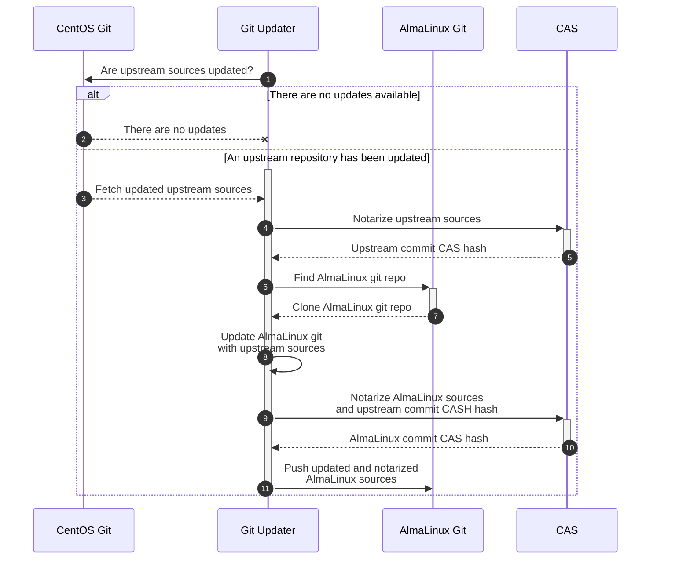
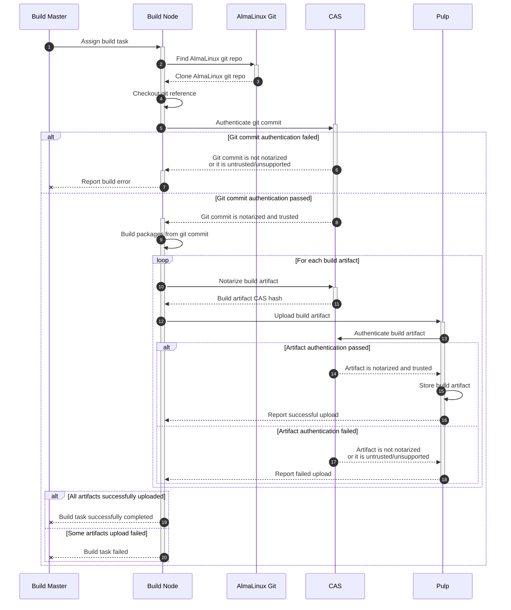
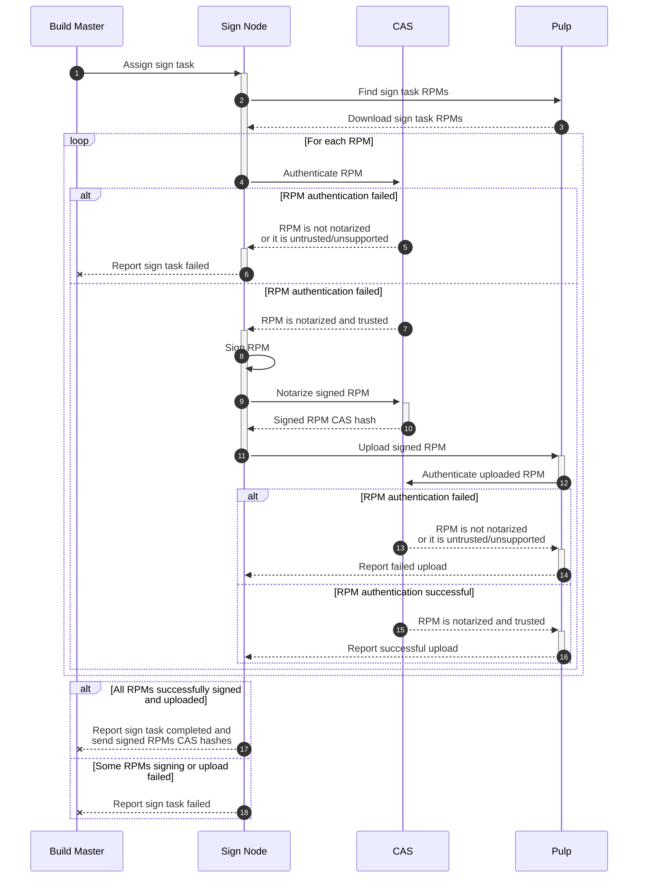
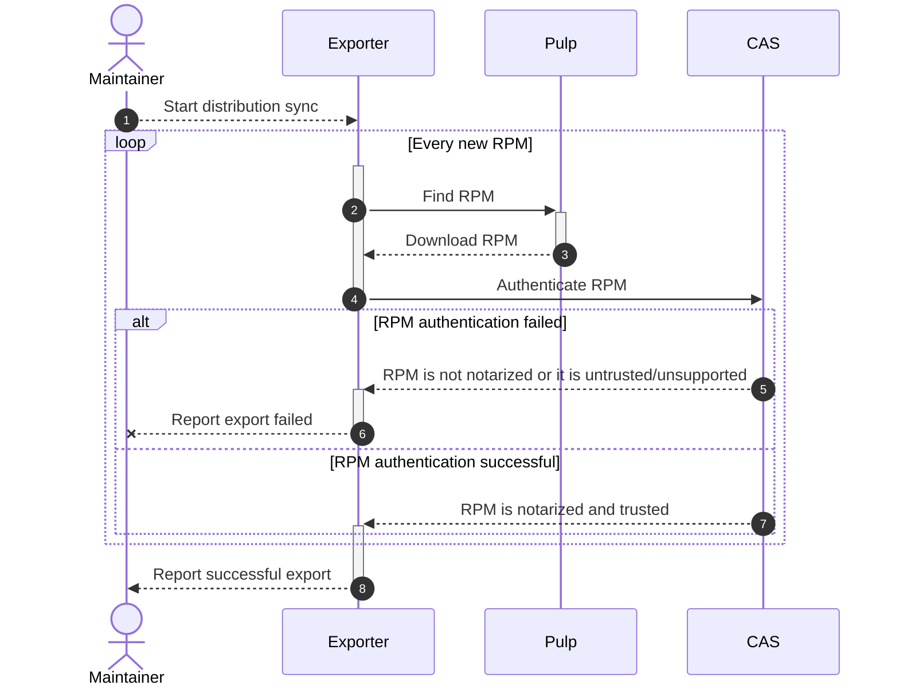

# [RFE] Implement SBOM in the AlmaLinux Build System


## Introduction

### Purpose of document

This document describes an [SBOM](https://en.wikipedia.org/wiki/Software_supply_chain)
implementation for the [AlmaLinux Build System](https://build.almalinux.org/)
based on the [Codenotary Community Attestation Service (CAS)](https://github.com/codenotary/cas).


### Purpose of SBOM integration

By integrating SBOM into our build pipeline we want to achieve the following
goals:

1. Secure our supply chain: ensure that the distribution updates were built
   from a trusted source, that an attacker didn't change/replace them after a
   build/testing stage and so on. Ideally, we would like to be able to trace a
   full path starting from CentOS git repositories and ending with delivering
   verified and signed packages to our public repositories.

2. Reduce the number of ways data can be corrupted (e.g. due to a software
   bug or a network error) in our system. Ensure that we always operate with
   valid and consistent data.

3. (A long-term goal) Make possible reproducible builds: we should keep and
   provide all information (e.g. dependencies list, mock options, source of
   a package, etc.) required to build a package in the same way that we did.


## SBOM integration overview

### AlmaLinux OS git repositories notarization



CAS supports git repositories notarization out of the box, it saves the
following information to the [immudb](https://github.com/codenotary/immudb) by
default:

```json
{
  "uid": "1655719129047694286",
  "kind": "git",
  "name": "git@github.com:AlmaLinux/cloud-images.git@5b9c88b",
  "hash": "5f1c7f203d2b90fb369da5f6b4bac5745b21b912326ade0860f66050ddb71aa4",
  "size": 835,
  "timestamp": "2022-06-20T09:58:49.047694286Z",
  "contentType": "",
  "metadata": {
    "git": {
      "Author": {
        "Email": "elkhan.mammadli@protonmail.com",
        "Name": "Elkhan Mammadli",
        "When": "2022-06-03T16:08:56+04:00"
      },
      "Commit": "5b9c88b35bc1edaa0f30e9e23a790044396b6b25",
      "Committer": {
        "Email": "noreply@github.com",
        "Name": "GitHub",
        "When": "2022-06-03T16:08:56+04:00"
      },
      "Message": "Merge pull request #97 from LKHN/ami-90\n\nAdd 9 AMIs and some fixes for Generic Cloud Images",
      "PGPSignature": "-----BEGIN PGP SIGNATURE-----\n\nwsBcBAABCAAQBQJimfnYCRBK7hj4Ov3rIwAA5CoIAJzD+iXIQ0MKqn9ql+KNGPNi\nSxUenCrZQiFn8NZ14saJwJKQUWpXHfWR2ej2K6WdD+X+0mjpUnoxF3QPhckNhVjA\nyutS8mcttagO25CTsorkTwOGYE1LTdzoU/13Ow+jYMMr7Zl6bb0M2GxZwLkpOiVd\ndLUHzvwzYUvcMh4vx1sq/7Dl4bqbYCbA/N1zavtxXFg94+JqOl19H6BeW5ASI1r1\n8U+9nW3J+vXCDu2FMyzTm03R+ghUvT/0/tRlR0df4OXjxCWZeh4g50U+7Fs22cJj\nWjWcv9ELKDhdHpI7tYDMqo6rLuRFk8pTi71yN8h4izSQwkSb92/SYiEPkIz+s+k=\n=HWtS\n-----END PGP SIGNATURE-----\n\n",
      "Parents": [
        "71fb43d2e4d0fd3f3ce3cceb8da6534c18a43f4c",
        "3afd0c736f78b929e40e1a32ab9271b1eeca978b"
      ],
      "Tree": "02c0afeb4182792c24310a178ac22ba9e1bc64f2"
    }
  },
  "signer": "ZXphbXJpeUBhbG1hbGludXgub3Jn",
  "revoked": "0001-01-01T00:00:00Z",
  "status": 0,
  "PublicKey": "",
  "verified": true,
  "Verbose": null
}
```

So that we can always get a git repository URL (`name`), a commit hash
(`metadata.git.Commit`) and other meta information by a record `hash`.

Technically, we need to do the following for CAS integration into the Git
Updater service:

1. After cloning an upstream git repository and checking out a target
   tag/branch (**3** message on the above diagram) notarize a commit (**4**)
   and save a CAS record `hash` for further processing:

   ```shell
   $ cas notarize git:///git_repository_path/ --bom -o json | jq -r '.hash'
   ```

2. Create a new commit based on the upstream commit for a matching AlmaLinux
   Git repository (**8**) and notarize it (**9** and **10**). Also, add the
   upstream commit CAS hash to the notarization record so that later it will
   be possible to trace the source:

   ```shell
    $ cas notarize git:///git_repository_path/ \
          --attr upstream_commit_sbom_hash="${UPSTREAM_COMMIT_CAS_HASH}" \
          --attr sbom_api_ver='0.1' \
          --bom \
          -o json | jq -r '.hash'
   ```

3. For automatically de-branded commits do the same but also add a CAS hash
   of the AlmaLinux GIT original (not de-branded) commit:

   ```shell
   $ cas notarize git:///git_repository_path/ \
         --attr upstream_commit_sbom_hash="${UPSTREAM_COMMIT_CAS_HASH}" \
         --attr alma_commit_sbom_hash="${ALMA_COMMIT_CAS_HASH}" \
         --attr sbom_api_ver='0.1' \
         --bom \
         -o json
   ```

After those changes implementation we will have a chain of trust between an
upstream git repository and our git repository.


### AlmaLinux OS Build System artifacts notarization



What should be done for CAS integration?

1. If source is the AlmaLinux Git repository, authenticate a git commit in CAS:
   ```shell
   $ cas authenticate git:///git_repo_path/
   # it should return 0 for authenticated and trusted commits
   ```
   Save the state of authentication for sending to master.
   
   Authentication state should be shown in UI for every project in build

2. Notarize each artifact after build is completed, even if source isn't authenticated:
   ```shell
   $ cas notarize LICENSE \
         --attr build_id=10 \
         --attr source_type=git \
         # this is only for commits from AlmaLinux git
         --attr alma_commit_sbom_hash="${ALMA_COMMIT_CAS_HASH}" \
         --attr git_url=https://example.com/example-git \
         --attr git_ref=test-ref \
         --attr git_commit=commit-hash \
         --attr build_host=example.almalinux.org \
         --attr built_by="Eugene Zamriy <ezamriy@almalinux.org>" \
         --attr sbom_api_ver=0.1 \
         --bom \
         --output json
   ```
3. Send a list of the artifacts and their CAS hashes to master.

4. The master should save CAS hashes to the database for each artifact.


What data should be added for each artifact?:

* build id
* reference (what is the source?)
  * For gits `source_type=git`:
    * URL
    * tag/branch
    * commit hash
  * For remote srpms `source_type=srpm`:
    * URL `srpm_url=`
    * checksum `srpm_sha256=`
  * For uploaded srpms `source_type=srpm`:
    * checksum `srpm_sha256=`
* Target architecture. `build_arch=`
* RPM headers fields:
  * name `name=`
  * epoch `epoch=`
  * version `version=`
  * release `release=`
  * arch `arch=`
  * sourcerpm `sourcerpm=`
* Build host name
* Notarization API version (e.g. 0.1) so that we can change data format later
  and handle that. We decided to call it `sbom_api_ver='0.1'`
* Author of the build (e-mail and name if available)


### Signed packages notarization



What should be done for CAS integration?

1. After downloading an unsigned RPM we should authenticate it in the CAS
   database (**4**) and copy its metadata so that we can add it to a signed
   RPM CAS record:

   ```shell
    $ cas authenticate ${FILE_PATH} --output json
    # it should return 0 status, the file should be TRUSTED
    # we should save the `metadata` from the json output
   ```

2. After signing we should notarize a signed RPM, add a reference to the
   matching unsigned RPM CAS record and copy the unsigned CAS record metadata.
   Also, get the signed RPM CAS hash:

   ```
   $ cas notarize ${FILE_PATH} \
         --attr unsigned_pkg_hash="${UNSIGNED_RPM_CAS_HASH}" \
         --attr sbom_api_ver=0.1 \
         --attr signed_by="Eugene Zamriy <ezamriy@almalinux.org>" \
         --attr sign_key_id="${PGP_KEY_ID}" \
         # TODO: add metadata attributes copied from the unsigned CAS record
         --attr .... \
         -- bom \
         --output json | jq '.hash' -r
   ```

3. Next, we should add the signed CAS record back reference to the unsigned
   CAS record:

   ```shell
   $ cas notarize --hash "${UNSIGNED_RPM_CAS_HASH}" \
         --attr signed_pkg_hash="${SIGNED_RPM_CAS_HASH}" \
         --sbom_api_ver=0.1
   ```


### Release pipeline notarization


What should be done for CAS integration in release pipeline?

1. Warn user if he try to release builds with unnotarized sources/packages,
   we can check this using information from database. Also there should be
   ability to release builds with unnotarized sources/packages

2. Add authentication for packages by their checksum from PULP during execution release plan,
   if some packages are not notarized, we should fail release and show error in release logs


## Codenotary CAS usage


### Get Codenotary CAS API key

To get started with the Codenotary CAS service you need to obtain an AIP key:
follow the instructions on the [cas.codenotary.com](https://cas.codenotary.com/)
page.


### Notarizing an asset

Notarization calculates an SHA-256 hash of an asset (e.g. file, directory, git
repository commit, etc.), collects metadata (depends on an asset format)
and creates a new trusted record in the CAS database:

```
# notarizes a git repository
$ cas notarize git:///home/ezamriy/work/almalinux/codenotary/cloud-images/

UID:		1654528312837519361
Kind:		git
Name:		git@github.com:AlmaLinux/cloud-images.git@5b9c88b
Hash:		5f1c7f203d2b90fb369da5f6b4bac5745b21b912326ade0860f66050ddb71aa4
Size:		835 B
Timestamp:	2022-06-06 15:11:52.837519361 +0000 UTC
Metadata:	git={
		    "Author": {
		        "Email": "elkhan.mammadli@protonmail.com",
		        "Name": "Elkhan Mammadli",
		        "When": "2022-06-03T16:08:56+04:00"
		    },
		    "Commit": "5b9c88b35bc1edaa0f30e9e23a790044396b6b25",
		    "Committer": {
		        "Email": "noreply@github.com",
		        "Name": "GitHub",
		        "When": "2022-06-03T16:08:56+04:00"
		    },
		    "Message": "Merge pull request #97 from LKHN/ami-90\n\nAdd 9 AMIs and some fixes for Generic Cloud Images",
		    "PGPSignature": "-----BEGIN PGP SIGNATURE-----\n\nwsBcBAABCAAQBQJimfnYCRBK7hj4Ov3rIwAA5CoIAJzD+iXIQ0MKqn9ql+KNGPNi\nSxUenCrZQiFn8NZ14saJwJKQUWpXHfWR2ej2K6WdD+X+0mjpUnoxF3QPhckNhVjA\nyutS8mcttagO25CTsorkTwOGYE1LTdzoU/13Ow+jYMMr7Zl6bb0M2GxZwLkpOiVd\ndLUHzvwzYUvcMh4vx1sq/7Dl4bqbYCbA/N1zavtxXFg94+JqOl19H6BeW5ASI1r1\n8U+9nW3J+vXCDu2FMyzTm03R+ghUvT/0/tRlR0df4OXjxCWZeh4g50U+7Fs22cJj\nWjWcv9ELKDhdHpI7tYDMqo6rLuRFk8pTi71yN8h4izSQwkSb92/SYiEPkIz+s+k=\n=HWtS\n-----END PGP SIGNATURE-----\n\n",
		    "Parents": [
		        "71fb43d2e4d0fd3f3ce3cceb8da6534c18a43f4c",
		        "3afd0c736f78b929e40e1a32ab9271b1eeca978b"
		    ],
		    "Tree": "02c0afeb4182792c24310a178ac22ba9e1bc64f2"
		}
		git_uri="git@github.com:AlmaLinux/cloud-images.git"
SignerID:	ZXphbXJpeUBhbG1hbGludXgub3Jn
Apikey revoked:	no
Status:		TRUSTED
```

It is also possible to add additional attributes to the metadata for further
processing using the `--attr key=value` command line argument(s):

```
# notarizes a git repository and adds additional metadata information
$ cas notarize git:///home/ezamriy/work/almalinux/codenotary/cloud-images/ \
               --attr verified_by=ezamriy@almalinux.org

UID:		1654528972904666602
Kind:		git
Name:		git@github.com:AlmaLinux/cloud-images.git@5b9c88b
Hash:		5f1c7f203d2b90fb369da5f6b4bac5745b21b912326ade0860f66050ddb71aa4
...
Metadata:	git={
		    ...
		}
		verified_by="ezamriy@almalinux.org"
SignerID:	ZXphbXJpeUBhbG1hbGludXgub3Jn
Apikey revoked:	no
Status:		TRUSTED
```


## SBOM data export

There are two main SBOM data format standards supported by the majority of
software:

  * [OWASP CycloneDX](https://cyclonedx.org/) - SBOM format created by
    Open Web Application Security Project ([OWASP](https://owasp.org/)). This
    format supports JSON and XML reports.
  * [SPDX](https://spdx.dev/) - ISO-standardized SBOM format created by Linux
    Foundation. This format supports JSON and Tag-Value reports.

We are going to start from the CycloneDX JSON reports and add other formats
later.

We are going to generate SBOM data for the following components:

  * build system packages (stage 1)
  * build system builds (stage 1)
  * official AlmaLinux OS container images (stage 2)
  * AlmaLinux OS repositories (stage 3)
  * AlmaLinux OS ISO images (stage 3)


### CycloneDX JSON SBOM data export

The CycloneDX specification can be found here:
https://cyclonedx.org/specification/overview/. There is also an official Python
library for generating SBOM data: https://github.com/CycloneDX/cyclonedx-python-lib.


### AlmaLinux package SBOM data record

```json
{
  "bomFormat": "CycloneDX",
  "specVersion": "1.4",
  // it's recommended for every generated BOM to have a unique RFC-4122 serial
  // number even if its content is not changed.
  "serialNumber": "urn:uuid:2ce31adb-343d-4573-85ea-e6c4569cd8a6",
  // BOM document version. It should be incremented by 1 every time when a BOM
  // is modified (e.g. package is signed).
  "version": 1,
  // BOM (in our case package) metadata
  "metadata": {
    // timestamp when a BOM (package) was created. In our case it's a package
    // build time extracted from the "buildtime" RPM tag.
    "timestamp": "2022-09-09T11:16:57+00:00",
    // information about tool(s) used in the creation of the BOM
    "tools": [
      {
        "vendor": "AlmaLinux OS Foundation",
        "name": "AlmaLinux Build System",
        "version": "0.1"
      },
      {
        "vendor": "Codenotary Inc",
        "name": "Community Attestation Service (CAS)",
        // can be extracted from the "cas --version" output
        "version": "1.0.0"
      }
    ],
    "component": {
      "type": "library",
      // package name
      "name": "bash",
      // "epoch:version-release" tags in an RPM package. Epoch should be
      // omitted if not defined.
      "version": "4.4.20-4.el8_6",
      // package publisher
      "publisher": "AlmaLinux",
      // RPM package checksum
      "hashes": [
        {
          "alg": "SHA-256",
          "content": "aeb7b7d638ebad749c8ef2ec7c8b699201e176101f129a49dcb5781158e95632"
        }
      ],
      // CPE name accordingly to this specification:
      // https://nvd.nist.gov/products/cpe. A detailed explanation is provided
      // after this code snippet.
      "cpe": "cpe:2.3:a:almalinux:bash:4.4.20-4.el8_6:*:*:*:*:*:*:*",
      // package URL accordingly to this specification:
      // https://github.com/package-url/purl-spec
      "purl": "pkg:rpm/almalinux/bash@4.4.20-4.el8_6?arch=x86_64\u0026epoch=1\u0026upstream=bash-4.4.20-4.el8_6.src.rpm",
      "properties": [
        // RPM package epoch if present ("epoch" tag)
        {
          "name": "almalinux:package:epoch",
          "value": "1"
        },
        // RPM package version ("version" tag)
        {
          "name": "almalinux:package:version",
          "value": "4.4.20"
        },
        // RPM package release ("release" tag)
        {
          "name": "almalinux:package:release",
          "value": "4.el8_6"
        },
        // RPM package architecture ("arch" tag)
        {
          "name": "almalinux:package:arch",
          "value": "x86_64"
        },
        // RPM package source RPM name ("sourcerpm" tag)
        {
          "name": "almalinux:package:sourcerpm",
          "value": "bash-4.4.20-4.el8_6.src.rpm"
        },
        // RPM package build host ("buildhost" tag)
        {
          "name": "almalinux:package:buildhost",
          "value": "x64-builder02.almalinux.org"
        },
        // build system target architecture
        {
          "name": "almalinux:albs:build:targetArch",
          "value": "x86_64"
        },
        // build system package type (we are going to support debs later)
        {
          "name": "almalinux:albs:build:packageType",
          "value": "rpm"
        },
        // see the "Package build source information" section below of this
        // code snippet.
        {
          "name": "almalinux:albs:build:source:type",
          "value": "git"
        },
        {
          "name": "almalinux:albs:build:source:gitURL",
          "value": "https://git.almalinux.org/rpms/bash.git"
        },
        {
          "name": "almalinux:albs:build:source:gitRef",
          "value": "c8"
        },
        {
          "name": "almalinux:albs:build:source:gitCommit",
          "value": "5cd0d67a640d79bbbbd09ed867f699136b4db8b6"
        },
        {
          "name": "almalinux:albs:build:source:gitCommitCasHash",
          "value": "7cef62002334937b491a9346aa054fa0d7d44bcc709aae7ec42b8a2b8ae544ce"
        },
        // SBOM CAS record hash
        {
          "name": "almalinux:sbom:casHash",
          "value": "aeb7b7d638ebad749c8ef2ec7c8b699201e176101f129a49dcb5781158e95632"
        },
        // build system build unique identifier
        {
          "name": "almalinux:albs:build:ID",
          "value": "478"
        },
        // build system build URL
        {
          "name": "almalinux:albs:build:URL",
          "value": "https://build.almalinux.org/build/478"
        },
        // build system build author
        {
          "name": "almalinux:albs:build:author",
          "value": "Eugene Zamriy <ezamriy@almalinux.org>"
        }
      ]
    }
  }
}
```

The `cpe` package field uses the following format:

```
cpe:<cpe_spec_version>:<part>:<vendor>:<product>:<version>:<update>:<edition>:<language>:<sw_edition>:<target_sw>:<target_hw>:<other>
```

where:

  * `cpe_spec_version` - the CPE specification version, the latest one is 2.3 at
      the moment of writing.
  * `part` - a component type: `a` for applications, `h` for hardware and
      `o` for operating systems. We should use `a` for packages.
  * `vendor` - a person or organization that created a component. In our case
      the value should be `almalinux`.
  * `product` - a component name. For packages it should be a package name
      (e.g. `bash`).
  * `version` - a component version. For packages it should be a package
      version in the `${version}-${release}` format for packages without epoch
      and `${epoch}\\:${version}-${release}` format for packages with epoch
      defined.

The rest of fields is not usable for packages and should have the `*` value.
If you are interested, you can find their description there:
https://en.wikipedia.org/wiki/Common_Platform_Enumeration.

Here is an example CPE value for the `0:bash-4.4.20-4.el8_6` package:

```
cpe:2.3:a:almalinux:bash:4.4.20-4.el8_6:*:*:*:*:*:*:*
```

The `purl` package field contains a package URL formatted accordingly to the
[package URL specification](https://github.com/package-url/purl-spec):

```
pkg:<type>/<namespace>/name@version?qualifiers
```

where:

  * `type` - a package type. For AlmaLinux OS it should be always `rpm`.
  * `namespace` - an organization namespace. In our case it should be `almalinux`.
  * `name` - a package name (e.g. `bash`).
  * `version` - a package version in the `${version}-${release}` format.
  * `qualifiers` - extra data for a package such as architecture or epoch.
      For our case we are going to use the following qualifiers:
    * `arch` - a package architecture (e.g. `noarch` or `x86_64`).
    * `epoch` - a package epoch if present.
    * `upstream` - a package source RPM name (e.g. `bash-4.4.20-4.el8_6.src.rpm`).
        The [syft](https://github.com/anchore/syft) project uses that field
        name, so we are going to keep it for compatibility reasons.

Here is an example `purl` for the `1:bash-4.4.20-4.el8_6.x86_64` package:

```
pkg:rpm/almalinux/bash@4.4.20-4.el8_6?arch=x86_64\u0026epoch=1\u0026upstream=bash-4.4.20-4.el8_6.src.rpm
```

There is Python library [packageurl-python](https://github.com/package-url/packageurl-python)
that may be useful for generating package URLs.


#### Package build source information

Each built package should contain information about sources that were used for
its build in the `almalinux:albs:build:source:type` attribute. The value of it
is stored in the `source_type` attribute in a CAS database package record.
The Build System supports the following sources for packages:

  * `git` - a git repository (typically on [git.almalinux.org](https://git.almalinux.org)).
  * `srpm` - a pre-made source RPM. A user can either provide the source RPM
      URL or upload it to the Build System manually.

For packages built from git repositories we provide the following SBOM
attributes:

  * `almalinux:albs:build:source:gitURL` - (required) a git repository URL
      (`git_url` in the CAS database).
  * `almalinux:albs:build:source:gitRef` - (required) a git repository reference
      (e.g. a tag or branch name). In the CAS database it is called `git_ref`.
  * `almalinux:albs:build:source:gitCommit` - (required) a git commit  hash
      (`git_commit` in the CAS database).
  * `almalinux:albs:build:source:gitCommitCasHash` - (optional) a CAS hash of
      the notarized git commit record (`alma_commit_sbom_hash` in the CAS
      database). Currently, the Build System supports notarization only for
      [git.almalinux.org](https://git.almalinux.org/) commits.

For packages built from a source RPM we use the following SBOM attributes:

  * `almalinux:albs:build:source:srpmURL` - (optional) a source RPM URL if we
     know it (`srpm_url` in the CAS database).
  * `almalinux:albs:build:source:srpmChecksum` - (required) a source RPM SHA-256
     checksum (`srpm_sha256` in the CAS database).
  * `almalinux:albs:build:source:srpmNEVRA` - (required) a source RPM
      `${epoch}:${name}-${version}-${release}.${arch}` (`srpm_nevra` in the
      CAS database).


### Build System build SBOM data record

A minimal build system build SBOM data record example is shown below:

```json
{
  "bomFormat": "CycloneDX",
  "specVersion": "1.4",
  // it's recommended for every generated BOM to have a unique RFC-4122 serial
  // number even if its content is not changed.
  "serialNumber": "urn:uuid:2ce31adb-343d-4573-85ea-e6c4569cd8a6",
  // BOM document version. It should be incremented by 1 every time when a BOM
  // is modified (e.g. build is changed).
  // In our case it means we should increment it every time we add a new
  // artifact, sign a build, etc.
  "version": 1,
  // BOM (in our case build) metadata
  "metadata": {
    // timestamp when the BOM was created. In our case it's a build creation
    // timestamp in the UTC timezone.
    "timestamp": "2022-09-09T11:16:57+00:00",
    // information about tool(s) used in the creation of the BOM
    "tools": [
      {
        "vendor": "AlmaLinux OS Foundation",
        "name": "AlmaLinux Build System",
        "version": "0.1"
      },
      {
        "vendor": "Codenotary Inc",
        "name": "Community Attestation Service (CAS)",
        // can be extracted from the "cas --version" output
        "version": "1.0.0"
      }
    ],
    "component": {
      // type of a component, see a list of allowed types here:
      // https://cyclonedx.org/docs/1.4/json/#metadata_component_type.
      // It seems like "library" is the best choice for build system builds.
      "type": "library",
      // name of a component. It's required, so I propose use
      // "build-${BUILD_ID}" as something that we can easily generate.
      "name": "build-478",
      // build's author
      "author": "Eugene Zamriy <ezamriy@almalinux.org>",
      // every component can have an arbitrary list of properties that contain
      // data not officially supported by the CycloneDX format.
      "properties": [
        {
          // build system build unique identifier
          "name": "almalinux:albs:build:ID",
          "value": "478"
        },
        {
          // build system build URL
          "name": "almalinux:albs:build:URL",
          "value": "https://build.almalinux.org/build/478"
        }
      ]
    }
  },
  // a list of packages in the build
  "components": [
    {
      "type": "library",
      // "name" tag in an RPM package
      "name": "bash",
      // "epoch:version-release" tags in an RPM package. Epoch should be
      // omitted if not defined.
      "version": "4.4.20-4.el8_6",
      // "vendor" tag in an RPM package
      "publisher": "AlmaLinux",
      // RPM package checksum
      "hashes": [
        {
          "alg": "SHA-256",
          "content": "aeb7b7d638ebad749c8ef2ec7c8b699201e176101f129a49dcb5781158e95632"
        }
      ],
      // CPE name accordingly to this specification:
      // https://nvd.nist.gov/products/cpe
      "cpe": "cpe:2.3:a:almalinux:bash:4.4.20-4.el8_6:*:*:*:*:*:*:*",
      // package URL accordingly to this specification:
      // https://github.com/package-url/purl-spec
      "purl": "pkg:rpm/almalinux/bash@4.4.20-4.el8_6?arch=x86_64\u0026epoch=1\u0026upstream=bash-4.4.20-4.el8_6.src.rpm",
      "properties": [
        // RPM package epoch if present ("epoch" tag)
        {
          "name": "almalinux:package:epoch",
          "value": "1",
        },
        // RPM package version ("version" tag)
        {
          "name": "almalinux:package:version",
          "value": "4.4.20"
        },
        // RPM package release ("release" tag)
        {
          "name": "almalinux:package:release",
          "value": "4.el8_6"
        },
        // RPM package architecture ("arch" tag)
        {
          "name": "almalinux:package:arch",
          "value": "x86_64"
        },
        // RPM package source RPM name ("sourcerpm" tag)
        {
          "name": "almalinux:package:sourcerpm",
          "value": "bash-4.4.20-4.el8_6.src.rpm"
        },
        // RPM package build host ("buildhost" tag)
        {
          "name": "almalinux:package:buildhost",
          "value": "x64-builder02.almalinux.org"
        },
        // build system target architecture
        {
          "name": "almalinux:albs:build:targetArch",
          "value": "x86_64"
        },
        // build system package type (we are going to support debs later)
        {
          "name": "almalinux:albs:build:packageType",
          "value": "rpm"
        },
        {
          "name": "almalinux:albs:build:source:type",
          "value": "srpm"
        },
        {
          "name": "almalinux:albs:build:source:srpmURL",
          "value": "https://build.almalinux.org/pulp/content/builds/AlmaLinux-8-src-4375-br/Packages/m/mc-4.8.19-9.el8.src.rpm"
        },
        {
          "name": "almalinux:albs:build:source:srpmChecksum",
          "value": "3b6523380baa44feb7310905c256a3de3530757a863837274fae9b9a5e6f9280"
        },
        {
          "name": "almalinux:albs:build:source:srpmNEVRA",
          "value": "1:mc-4.8.19-9.el8.src"
        },
        // SBOM CAS record hash
        {
          "name": "almalinux:sbom:casHash",
          "value": "aeb7b7d638ebad749c8ef2ec7c8b699201e176101f129a49dcb5781158e95632"
        },
        // build system build unique identifier
        {
          "name": "almalinux:albs:build:ID",
          "value": "478"
        },
        // build system build URL
        {
          "name": "almalinux:albs:build:URL",
          "value": "https://build.almalinux.org/build/478"
        },
        // build system build author
        {
          "name": "almalinux:albs:build:author",
          "value": "Eugene Zamriy <ezamriy@almalinux.org>"
        }
      ]
    }
  ]
}
```

The `serialNumber` can be generated using the `uuid` Python module:

```python
import uuid
uuid.uuid4()
> UUID('2ce31adb-343d-4573-85ea-e6c4569cd8a6')
```


## Possible future improvements

* Add a dedicated arbiter node that should securely process data.


## References

* [AlmaLinux Git Updater](https://github.com/AlmaLinux/git_migrator)
* [CPE (common platform enumeration) specifications](https://cpe.mitre.org/specification/)
* [Purl (package URL) specification](https://github.com/package-url/purl-spec)
* [packageurl-python](https://github.com/package-url/packageurl-python) -
    a Python library to parse and generate package URLs.


## Authors

* [Eugene Zamriy](mailto:ezamriy@almalinux.org)
* [Vasiliy Kleschov](mailto:vkleschov@almalinux.org)
